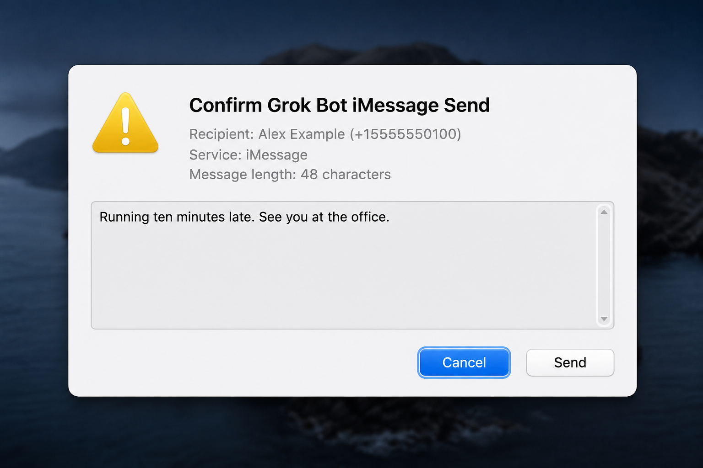

# Claude Cowork iMessage skill

Read, search, and analyze your iMessages on macOS from inside Claude Cowork.

**Security**: See [SECURITY.md](SECURITY.md) for vulnerability reporting.

## What's in the box

- **Skill** `imessage-review` — teaches Claude the full protocol for reading
  and sending iMessages via an on-device helper. Triggers on natural
  language like *"show me iMessages from X"*, *"triage my unread
  messages"*, *"average reply time to Y"*, *"text Alice: see you at 3"*.
- **Command** `/imessage-review:imessages [days]` — one-shot triage of the
  last N days (default 2). Categorizes threads into needs-reply /
  low-priority / skipped.
- **Bundled helper** — source for a tiny hardened C wrapper that holds the
  Full Disk Access grant, plus the Python worker that reads `chat.db`,
  resolves contacts, redacts sensitive content, drives `osascript` for
  outbound sends, and writes JSON responses.

## What it does

Eight helper actions. All take a short JSON request and return a JSON
response via the bridge folder. Claude picks the right one from plain
English — you generally don't need to know the action names.

| Action | Ask Claude something like | What it does |
|---|---|---|
| `review` | *"Triage my iMessages from the last 2 days."* | Sorts every thread into `needs reply` / `low priority` / `skipped`, with full text for the needs-reply bucket. |
| `search` | *"Find messages mentioning 'quarterly review' in the last month."* | Substring search across every thread. Scopes by days + result limit. |
| `chat_history` | *"Show me the last 50 messages with the sales-team group chat."* | Pulls recent messages from one conversation. Accepts name, phone, email, or group-chat ID. |
| `response_stats` | *"How fast have I been replying to my manager this week?"* | Avg / median / min / max reply time, plus inbound vs. outbound counts. |
| `contacts_lookup` | *"Look up contacts named 'Smith'."* | Disambiguates by name. Useful before `chat_history` on an ambiguous name. |
| `send_preview` | *(used implicitly by the skill before every send)* | Dry-run of a `send` — validates recipient + body, resolves the contact name, flags blocklisted threads. No osascript call, no chat.db read. |
| `send` | *"Text +14155551234: 'Confirmed for Thursday at 3pm.'"* | Actually delivers the message via AppleScript (`tell application "Messages"`). Always preceded by `send_preview` and explicit user approval. |
| `status` | *"Check whether my iMessage helper is healthy."* | Reports helper/protocol versions and local installation checks without reading messages. |

**Chained workflows** Claude handles naturally because the read + send
actions share a bridge:

- *"Triage the last day, then draft replies to anything actionable."*
- *"Find any mention of 'invoice' in the last 60 days, group by sender."*
- *"Who has the slowest reply time from me this week? Top 5 with stats."*
- *"Text Angel back with a thumbs-up and propose Thursday at 2pm instead."*

**What the plugin won't do:**

- No attachments, images, stickers, audio, or Tapback reactions (outbound
  or inbound — text fields only).
- No editing or deleting previously sent messages.
- No message effects (balloons, confetti, invisible ink).
- No group-chat sending or creation. Outbound recipients must be an
  individual phone number or email address.
- Only reads your local `chat.db` — if a thread hasn't synced to this
  Mac, it won't appear in search / review.

## How it works

The Cowork agent runs in a Linux sandbox that can't see `~/Library/Messages`.
This plugin installs a `launchd` agent on your Mac that watches for JSON
request files in a *bridge folder* (any folder you select as your Cowork
workspace). When Claude writes a request file, launchd fires the helper,
which reads the Messages database, processes the request, and writes a JSON
response back into the same folder — where Claude can then read it.

```
  Cowork (Linux sandbox)                 Your Mac
  ----------------------                 --------
  writes request.json  -->  launchd  -->  helper reads chat.db
                                          writes response.json
  reads response.json  <-----------------/
```

Sending iMessages runs through the **same** bridge. After a payload-bound nonce
check, the helper opens a native macOS confirmation window showing the exact
recipient and complete body. Cancel is the keyboard default. Only an explicit
Send click permits the helper to invoke `/usr/bin/osascript`.

The helper uses the host-specific LaunchAgent
`com.jeffhuber.claudecowork-imessage`, so it can run alongside the sibling
Grok Bot helper. Each host must use its own bridge folder, request queue,
responses, policies, logs, and nonces.

## Coexistence

These are independent helpers by design. Each uses distinct LaunchAgents, wrappers, bridges, FDA grants, and runtime state. Do not share a bridge folder, request queue, or Full Disk Access grant between hosts. Three independent copies is the architecture — not a temporary state before unification.

- **Grok Bot** — LaunchAgent `com.jeffhuber.grokbot-imessage`, wrapper `grokbot-imessage-helper` — https://github.com/jeffhuber/grokbot-imessage-skill
- **Claude Cowork** — LaunchAgent `com.jeffhuber.claudecowork-imessage`, wrapper `claude-cowork-imessage-helper` — https://github.com/jeffhuber/claudecowork-imessage-skill
- **ChatGPT/Codex** — LaunchAgent `com.jeffhuber.chatgpt-codex-imessage`, wrapper `chatgpt-codex-imessage-helper` — https://github.com/jeffhuber/chatgpt-codex-imessage-plugin

## Install

### 1. Install the plugin

Download `imessage-review.plugin` and `SHA256SUMS` from the
[latest release](../../releases/latest), verify the checksum, then install the
plugin in Claude Cowork. Release archives contain source only; the macOS
binaries are compiled and signed locally.

To build the plugin from source:

```
git clone https://github.com/jeffhuber/claudecowork-imessage-skill.git
cd claudecowork-imessage-skill
zip -r imessage-review.plugin . -x "*.DS_Store" "__pycache__/*" \
  "*/__pycache__/*" ".git/*"
```

### 2. Select a bridge

Pick a dedicated folder Claude Cowork can access, such as
`~/Documents/claude-imessage-bridge`. Ask Claude to bootstrap this plugin's
helper assets into that folder, or run the bundled script directly:

```bash
"<installed-plugin-assets>/skills/imessage-review/bootstrap.sh" \
  "$HOME/Documents/claude-imessage-bridge"
cd "$HOME/Documents/claude-imessage-bridge"
```

Never point Claude and Grok at the same bridge. Their LaunchAgents and binaries
are host-specific, and their requests, responses, policies, logs, and nonces
must remain independent.

### 3. Choose an installation mode

**Standard per-user install:**

```bash
./install.sh
```

This requires no administrator access and defaults to a user-editable
blocklist. Code in the bridge is writable by processes running as your user,
so this mode does not resist a compromised same-user process.

**Hardened install (optional):**

```bash
./install-hardened.sh
```

This invokes `sudo` narrowly to install trusted code under
`/Library/Application Support/ClaudeCoworkIMessage/users/<uid>/libexec`.
The selected bridge remains user-owned so Cowork can use it. Reads are
default-deny through a root-owned allowlist:

```bash
CODE_ROOT="/Library/Application Support/ClaudeCoworkIMessage/users/$UID/libexec"
python3 "$CODE_ROOT/tools/configure_allowlist.py" add +15551234567
```

Both modes compile the wrapper and native confirmation helper locally, create
private runtime directories, install
`com.jeffhuber.claudecowork-imessage`, and print the exact wrapper path that
must receive Full Disk Access.

### 4. Grant permissions and verify

Grant Full Disk Access to the exact wrapper printed by the installer. The first
approved send separately prompts for Automation access to Messages. Then run
the printed `doctor.py` command and follow [the smoke test](docs/SMOKE_TEST.md).

## Sending

Sending is a first-class helper action, with no Computer Use or automated GUI
clicks. The helper invokes AppleScript only after both its nonce gate and a
native, fail-closed confirmation window approve the exact payload.

### How to use it

Just ask Claude in plain English:

> "Text +14155551234: 'Confirmed for Thursday at 3pm.'"

Claude will:

1. Run a `send_preview` to show you the resolved recipient, service
   (iMessage vs. SMS), and full text.
2. **Wait for your explicit OK.** Nothing sends until you confirm.
3. Run `send`. A native macOS window shows the exact phone/email, service, and
   full body. Cancel is the Return-key default and a timeout cancels the send.



*The native confirmation dialog (shown here with example payload from Grok Bot). Cancel is the Return-key default. The same NSAlert is used by all three iMessage helpers (Grok Bot, Claude Cowork, ChatGPT/Codex).*

4. Deliberately click **Send**. The helper invokes `osascript` and removes its
   UTF-8 body tempfile whether delivery succeeds or fails.

### One-time permission: Automation → Messages

On the first send, macOS shows an Automation prompt:
*"claude-cowork-imessage-helper wants to control Messages"*. Click **OK**.
After that, the grant
lives under:

  System Settings → Privacy & Security → Automation →
    claude-cowork-imessage-helper → Messages

This is a **different permission** from Full Disk Access. FDA lets the
helper read `chat.db`; Automation lets it drive Messages.app via
AppleScript.

### What gets validated before osascript even runs

- Recipient is an individual phone number or conservative ASCII email address.
  Names and every `chat...` group identifier are rejected.
- Text is 1–4000 UTF-8 characters with no C0 control bytes other than
  `\n`, `\r`, `\t`.
- Service is `iMessage`, `SMS`, or unset (defaults to iMessage).
- Recipient is **not** on `contacts/blocked_chats.txt` — blocklist still
  applies to outbound as well as inbound.
- A fresh, payload-bound `send_nonce` minted by a prior
  `send_preview` within the last 60 seconds is present on the `send`
  request. The helper refuses sends without one, sends whose body has
  been changed after preview, and sends that replay a used nonce. This
  puts the preview/confirm gate in the helper rather than in the skill
  prompt — a compromised client can't skip the preview step.

### What it can't do

- Attachments / images / stickers / replies-to-specific-message — AppleScript
  exposes a simple `send <text> to <buddy>` shape. Plain text only.
- Message effects (balloon, confetti, etc.).
- Group-chat sending or creation.

## Requirements

- macOS (the helper is Apple-specific — SQLite + launchd + Contacts.app +
  osascript).
- Xcode Command Line Tools (`xcode-select --install`) — for `clang` and
  `codesign` during install.
- Python 3.9 or newer (uses `/usr/bin/python3` if available).
- `/usr/bin/osascript` — ships with macOS, used for sending.

### Compatibility

| Component | Supported and verified | Notes |
|---|---|---|
| macOS | 13+; CI on `macos-latest` | Messages SQLite and AppleScript are undocumented or legacy integration surfaces and can change. |
| Python | 3.9, 3.11, and 3.13 in CI | The installers require 3.9+. |
| Native build | Apple Clang on `macos-latest` | Binaries are compiled from source on the target Mac. |
| Claude | Claude Cowork plugin bundle | Cowork must be able to access the selected bridge folder. |

## Privacy

### Automatic redaction

Before returning a response, the helper runs a regex-based redactor that
masks:

- 2FA / verification codes (`code`, `passcode`, `OTP`, `one-time` contexts)
- Credit-card-like digit runs (13–19 digits, with or without `-` / space
  separators)
- US SSN patterns (`NNN-NN-NNNN`)

### Thread-level blocklist

You can block entire threads from ever entering Claude's context by adding
them to `<bridge folder>/contacts/blocked_chats.txt` (phone numbers,
emails, or group-chat IDs — one per line). Blocked threads are dropped
before the redactor even runs.

### Read policy

The hardened install enforces a root-owned, default-deny allowlist. Only listed
phone numbers, emails, and group identifiers can appear in message or contact
responses. A same-user process cannot broaden that policy without administrator
approval. The standard install uses `contacts/read_policy.txt` (`blocklist` by
default); it can be changed to `allowlist`, but that policy remains user-editable.
The blocklist always takes precedence in either mode.

### Consent — the thing nobody else on the thread agreed to

When you use this plugin, you're piping both sides of your conversations —
including messages you received from other people — into a commercial LLM
(Claude). Those people didn't consent to that, and in many cases they'd
reasonably object if they knew. This is an unavoidable property of any
"read my messages" tool, but it's worth sitting with before you run this
every morning as a habit.

**Strongly consider preemptively blocklisting** any thread that contains
messages you would not want an LLM to read, including:

- Therapists, counselors, clergy, medical providers
- Attorneys and anyone else you have privileged communication with
- Financial advisors, accountants
- Family members during a dispute or sensitive life event
- Minors (your kids, your kids' friends, babysitters, etc.)
- Anyone who has explicitly told you "please keep this between us"
- Journalists or sources, if you're one of those people
- Anyone in a jurisdiction with two-party-consent recording laws where
  running their messages through a third party might be an issue

Adding a chat to `contacts/blocked_chats.txt` is a one-line operation and
is enforced *before* redaction — those messages never reach Claude at all.

## Known limitations

Being upfront about what this tool does and doesn't do. None of these are
reasons to avoid using it — they're reasons to use it with your eyes open.

### Redaction is regex-based and has documented gaps

The redactor catches the common 2FA / card / SSN cases but is not a DLP
product. Known bypasses (all have regression tests under
`tests/test_redaction.py::RedactionKnownBypasses`, marked
`@expectedFailure`):

- Dot-separated credit cards (`4111.1111.1111.1111`)
- PIN-labelled codes (`Your PIN is 4829` — "PIN" isn't in the keyword list)
- Slash-separated SSNs (`123/45/6789`)
- Bare verification codes with no keyword (`839201 to confirm it's you`)
- API keys (Stripe `sk_live_*`, GitHub tokens, OpenAI keys, etc.)
- Bank account / routing numbers (below the 13-digit card floor)
- Home addresses
- Dates of birth

If you close one of these gaps, flip the `@unittest.expectedFailure`
decorator off in the matching test and it becomes a regression guard.

**Implication:** assume sensitive content will occasionally slip through.
The thread-level blocklist is the reliable filter; the regex is a
second line of defense, not the first.

### Full Disk Access grant is tied to a specific binary hash

The grant is attached to the ad-hoc-signed helper's **CDHash**, not its
path. That means:

- Re-running the installer against a **bit-identical** source rebuilds the
  same CDHash and the grant carries over.
- Changing the wrapper source, its baked paths, compiler output, or signing
  identity can produce a different CDHash, at which point macOS may require a
  fresh grant. Editing `helper.py` alone does not change the wrapper's CDHash;
  this is why hardened mode installs Python under a root-owned path and why the
  wrapper validates every loaded component before execution.
- macOS can also invalidate the grant on its own — major OS upgrades,
  Spotlight reindex weirdness, or TCC resets have all been reported.

**Symptom:** the helper stops responding, requests pile up unprocessed in
the bridge folder. **Fix:** re-open System Settings → Privacy & Security
→ Full Disk Access, remove the old entry, re-add the binary at the path
the installer prints.

### Privacy tradeoff: messages flow through a commercial LLM

This is not a local LLM pipeline. Every thread you surface flows through
Anthropic's API as part of the Claude context window and is subject to
Anthropic's data handling and retention policies, not yours. If that's not
acceptable for a specific conversation, blocklist it (see above).

### macOS-only, and leans on private-ish schemas

`chat.db` and `AddressBook-v22.abcddb` are Apple-internal SQLite schemas
with no stability guarantee. They've been stable for years, but a future
macOS release could rename a column and break the helper until someone
patches the queries. Same applies to the `attributedBody` typedstream
format that the decoder in `helper.py` reverse-engineers.

### Sending relies on AppleScript + the Messages.app Automation grant

Sending goes through the helper, which calls `/usr/bin/osascript` with a
short AppleScript `tell application "Messages"` block. That means:

- The first send triggers a macOS Automation prompt — you have to click
  **OK** to let the helper control Messages.app. The grant lives under
  System Settings → Privacy & Security → Automation.
- The helper accepts only individual phone numbers and conservative ASCII email
  addresses. It cannot determine in advance whether that handle is reachable on
  the selected service; an unreachable iMessage handle causes AppleScript to
  fail without sending.
- There's no "sent successfully to the network" confirmation. The helper
  only confirms that osascript returned 0. If the recipient blocks you or
  the network is down, iMessage will show the red ! bubble in
  Messages.app, but the helper won't know.

The tradeoff vs. the previous Computer-Use path is speed and reliability. The
current safety model is enforced in code: a single-use payload-bound nonce plus
an independent native confirmation dialog showing the complete message.

## Changelog

See [CHANGELOG.md](CHANGELOG.md). Version 1.1 aligns the Claude helper with the
Grok sibling: independent identities, native send confirmation, no-follow
runtime paths, consistent SQLite snapshots, diagnostics, and the optional
root-owned/default-deny trust model.

## Uninstall

Run `./uninstall-hardened.sh` for a hardened install or `./uninstall.sh` for a
standard install. Both remove only Claude's LaunchAgent and preserve runtime
data until you deliberately delete it. Revoke `claude-cowork-imessage-helper`
under Full Disk Access and Automation for a complete teardown.

## Upgrading from the legacy LaunchAgent

Versions through v0.4.0 used `com.user.cowork-imessage`, which later collided
with the original Grok helper identity. The installer removes that legacy agent
only when its plist points to the exact Claude bridge being upgraded. A legacy
agent belonging to Grok or an unknown installation is left untouched. Because
the new wrapper has a distinct name and signature, macOS may require Full Disk
Access and Automation approval once more.

## Development

```bash
python3 -m unittest discover -s tests -v
python3 tools/check_version.py v1.1.0
bash -n skills/imessage-review/*.sh
shellcheck skills/imessage-review/*.sh
```

CI also compiles the C and Objective-C helpers with warnings as errors, lints
the LaunchAgent plist, and tests Python 3.9, 3.11, and 3.13. See
`tests/README.md` for coverage details.

## License

MIT
